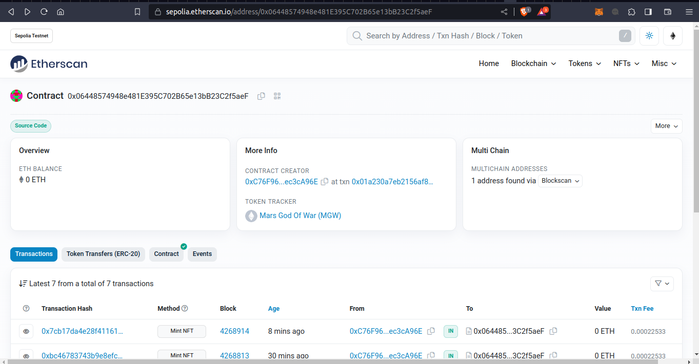
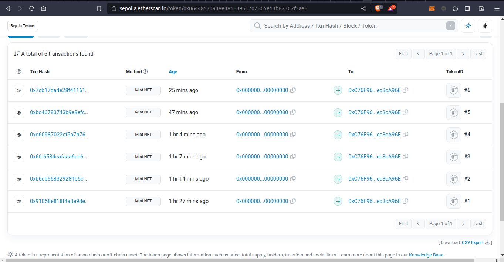
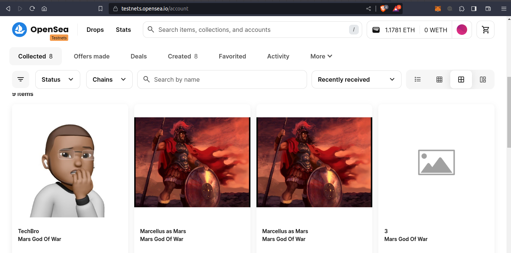
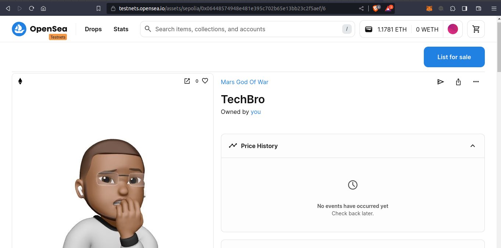
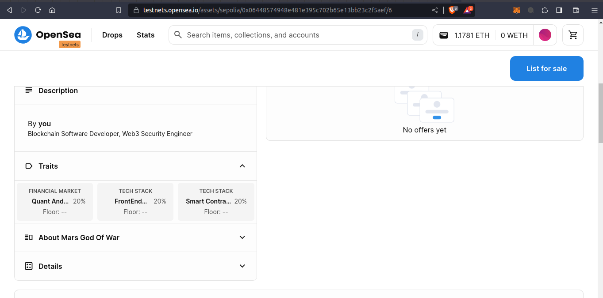
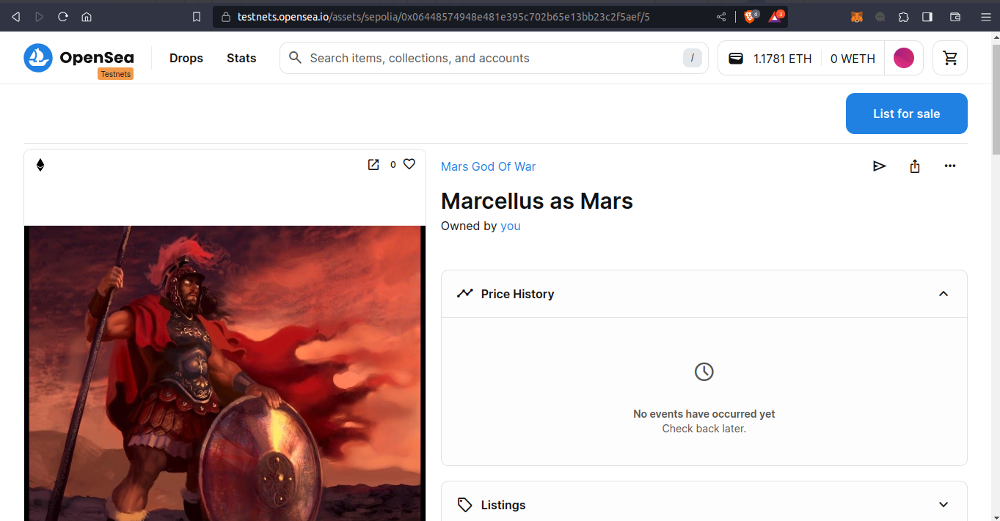
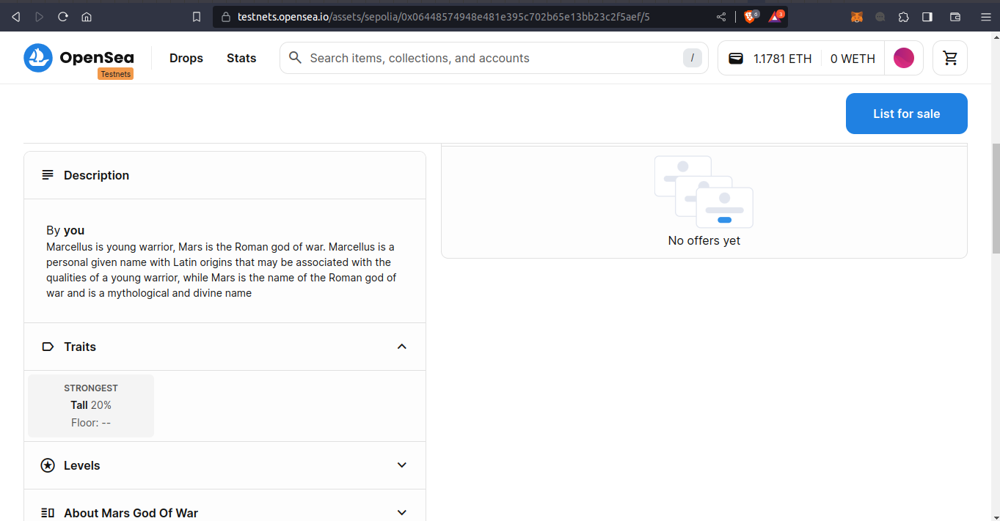

## Description:

Development of an NFT smart contract that conforms to the [Openzeppelin](https://docs.openzeppelin.com/contracts) in [ERC721](https://eips.ethereum.org/EIPS/eip-721) standard, deployed to a live testnet and visible on [OpenSea](https://opensea.io/), using [Solidity](https://soliditylang.org/) and [Hardhat](https://hardhat.org/) for the contract development and [TypeScript](https://www.typescriptlang.org/) and [Ethersjs](https://docs.ethers.org/v6/) for the scripting and contract interactions.

### GodOfWarNFT ContractAddress

https://sepolia.etherscan.io/address/0x06448574948e481E395C702B65e13bB23C2f5aeF

### OpenSea Links

- https://testnets.opensea.io/assets/sepolia/0x06448574948e481e395c702b65e13bb23c2f5aef/5

- https://testnets.opensea.io/assets/sepolia/0x06448574948e481e395c702b65e13bb23c2f5aef/6

### Deployed contract and Interactions View on Etherscan

### NFT View on OpenSea

